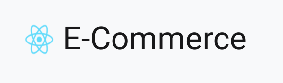
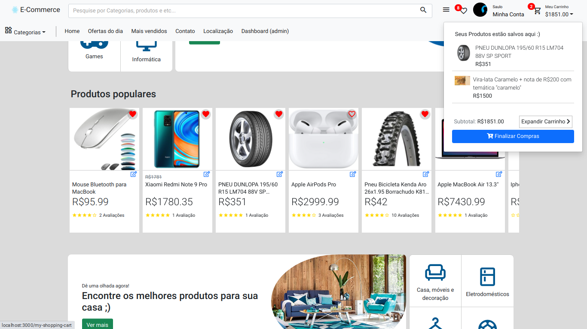
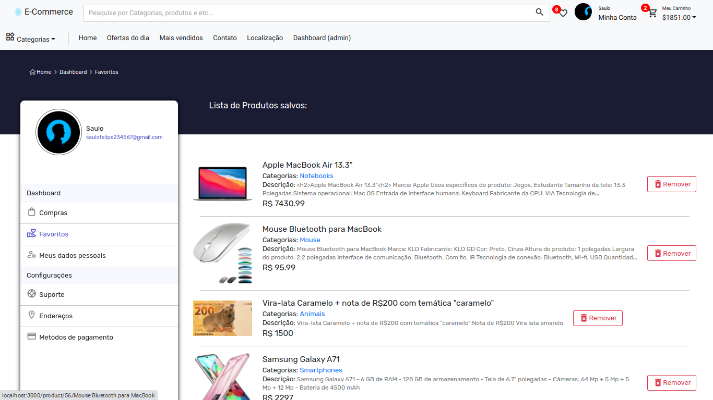
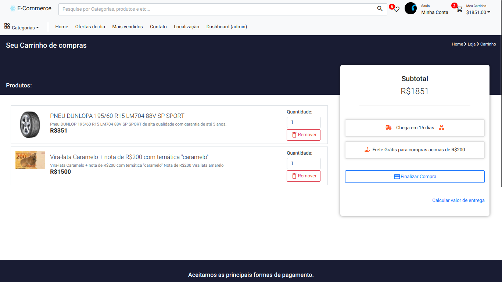
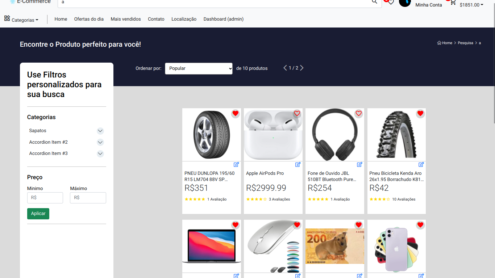
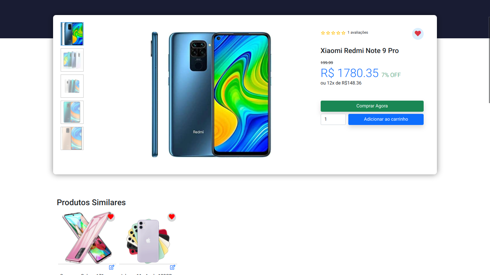
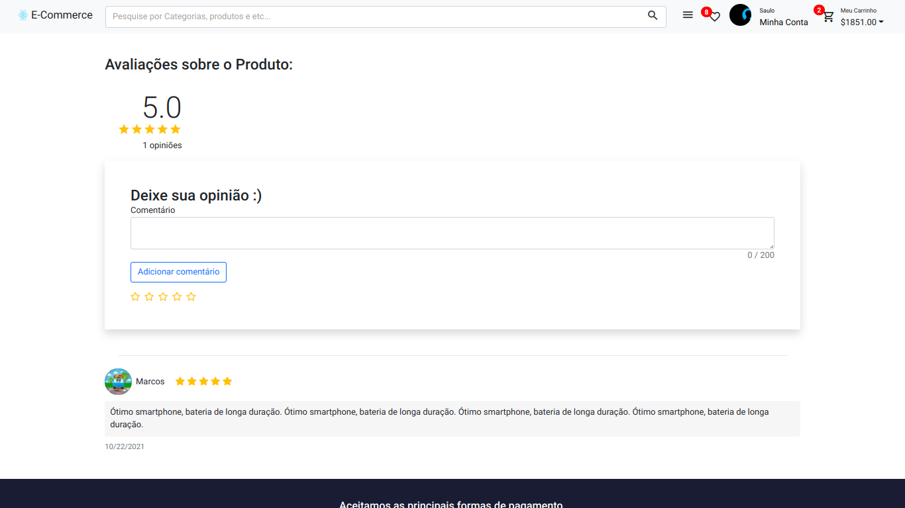

<p align="center">
    
</p>

------------------------------------
## Índice

* [Preview](#preview)
* [Sobre](#sobre)
* [Funcionalidades](#funcionalidades)
* [Layout](#layout)
* [Como Executar](#como-executar)
* [Tecnologias](#tecnologias)
* [Autor](#autor)
* [Licença](#licenca)

------------------------------------

## 💻 Sobre <a id="sobre"></a>
E-commerce construído inteiramente com ReactJS e NodeJS. Este projeto possui um layout totalmente responsivo e dinâmico. 
<br>

------------------------------------

## 🚀 Preview <a id="preview"></a>

-> https://e-commerce-frontend-olive.vercel.app

------------------------------------

## ⚙️ Funcionalidades <a id="funcionalidades"></a>
1. ✅ Responsividade
2. ✅ Dinâmico
3. ✅ Dashboard para administradores
4. ✅ suporta qualquer tipo de produto para venda
5. ✅ Todas as funcionalidades básica que um ecommerce possui

------------------------------------

## 🎨 Layout <a id="layout"></a>

<a href="https://e-commerce-frontend-saulo.herokuapp.com/"></a>


<p>*O Layout completo do site está disponível <a href="https://e-commerce-frontend-saulo.herokuapp.com/">aqui</a>.</p>









------------------------------------

## 🧩 Como Executar <a id="como-executar"></a>

Para executar o projeto na sua máquina, basta seguir a sequencia de passos:

```
# Clone o repositório
$ git clone https://github.com/Saulo-Felipe/eCommerce-ReactJS-NodeJS.git

# Inicie o servidor do Nodejs e React

eCommerce-ReactJS-NodeJS/frontend $ yarn dev
eCommerce-ReactJS-NodeJS/backend $ yarn dev

* é necessario a configuração de um banco de dados para adição dos produtos

```

------------------------------------

## 🤖 Tecnologias <a id="tecnologias"></a>

Neste e-commerce, foram utilizadas as seguintes tecnologias: 

* Bootstrap </img>
* HTML5 </img>
* CSS3 </img>
* Javascript </img>
* FontAewsome </img>
* Nodejs </img>
* React </img>
* PostgreSQL </img>

------------------------------------

## 👨 Autor <a id="autor"></a>

<p align="center">➡️ Criado e desenvolvido por <strong>eu</strong> mesmo 🧑‍💻.</p>

------------------------------------

## 📜 Licença <a id="licenca"></a>

<p align="center">Todos os direitos reservados ©Copyright - Saulo Felipe</p>
